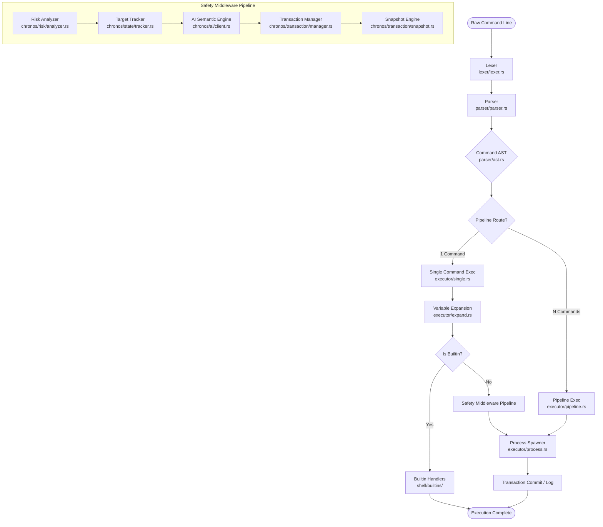

# Chronos

A transactional shell with file-level rollback, risk analysis, and AI-assisted safety guardrails.

[](https://www.rust-lang.org)
[](https://tokio.rs)
[](https://github.com/kkawakam/rustyline)
[](https://github.com/seanmonstar/reqwest)
[](https://serde.rs)

*   **107/107 unit tests passing** (100% pass rate)
*   **1.5 µs p95 parsing latency** (on 6-token dual-redirection commands)
*   **13 builtin commands** and **3 command constructs** supported
*   **1 level of tested nested expansion** (structurally enforced single-pass)

---

## 2. Overview

Chronos is a interactive command-line interpreter (shell) built in Rust that focuses on execution safety and fault recovery. Before executing potentially destructive shell commands, Chronos evaluates their risk level, checks targets on the local filesystem, queries an AI semantic engine for intent analysis, and creates database-style backup snapshots. If a command causes unwanted filesystem changes, Chronos allows developers to roll back the state of the system using transaction IDs.

Chronos intercepts commands within a multi-phase pipeline:
1.  **Lexing**: Raw input text is parsed into tokens, respecting quotes, backslashes, and metacharacters.
2.  **Parsing & AST Construction**: Tokens are structured into a deterministic Abstract Syntax Tree (`Command` with `Redirect` settings).
3.  **Variable Expansion**: Local variables are expanded prior to execution.
4.  **Builtin Dispatch**: Checks if the command matches a builtin.
5.  **Safety Middleware (External processes)**: Runs risk analysis, target tracking, AI guardrails, and filesystem snapshotting.
6.  **Spawning & Capturing**: Runs the process and captures exit status to complete the transaction.

---

## 3. Key Results

The following metrics are measured directly on host hardware using the automated test suite and reproducible benchmarks.

### Test Coverage
*   **Tests Passed**: 107/107 (100% pass rate)
*   **Integration Tests**: 0 (integration testing suite is currently empty)
*   **Parser & AST Tests**: 18 unit tests
*   **Lexer Tests**: 38 unit tests (including 8 security/adversarial tests)
*   **Expansion Tests**: 23 unit tests (verifying single-pass and boundary limits)
*   **Security & Risk Tests**: 28 unit tests
*   **CodeCrafters Results**: CodeCrafters evaluation unavailable from local environment.

### Performance
*   **p50 Latency**: 1.0 µs (1,000 ns) for a 6-token dual-redirection command (`echo data > out.txt 2> err.txt`)
*   **p95 Latency**: 1.5 µs (1,500 ns) for a 6-token dual-redirection command
*   **p99 Latency**: 2.7 µs (2,700 ns) for a 6-token dual-redirection command
*   **Throughput**: 821,922 ops/sec for dual-redirection commands; 2,171,788 ops/sec for single commands
*   **Largest Tested Input**: 10,000-character single-token string; 1,000 separate tokens (without panics)

### Scope
*   **Command Constructs**: 3 (single commands, redirections, and multi-stage pipelines)
*   **Variable Mechanisms**: 1 (shell-local key-value store, set via `declare` and read via `$`)
*   **Expansion Mechanisms**: Shell-local variable expansion (`$VAR` and `${VAR}`)
*   **Deepest Tested Nesting**: 1 level (recursion is blocked by single-pass expansion logic)

---

## 4. Architecture



### Component Details
*   **Lexer & Parser** ([`lexer.rs`](file:///c:/Users/elrsa/Desktop/Projects/chronos/src/lexer/lexer.rs), [`parser.rs`](file:///c:/Users/elrsa/Desktop/Projects/chronos/src/parser/parser.rs)): Converts command strings into tokens and parses redirections (`>`, `>>`, `2>`, `2>>`) to populate AST [`ast.rs`](file:///c:/Users/elrsa/Desktop/Projects/chronos/src/parser/ast.rs).
*   **Risk Analyzer** ([`analyzer.rs`](file:///c:/Users/elrsa/Desktop/Projects/chronos/src/chronos/risk/analyzer.rs)): Deterministically evaluates commands against a static risk matrix on a scale from 0 to 100, classifying commands into 6 risk levels.
*   **Target Tracker** ([`tracker.rs`](file:///c:/Users/elrsa/Desktop/Projects/chronos/src/chronos/state/tracker.rs)): Tracks target files, checks permissions, and maps access modes.
*   **AI Client** ([`client.rs`](file:///c:/Users/elrsa/Desktop/Projects/chronos/src/chronos/ai/client.rs)): Connects to the Google Gemini API to analyze intent and recommend blocks or escalations.
*   **Transaction Manager & Snapshot Engine** ([`manager.rs`](file:///c:/Users/elrsa/Desktop/Projects/chronos/src/chronos/transaction/manager.rs), [`snapshot.rs`](file:///c:/Users/elrsa/Desktop/Projects/chronos/src/chronos/transaction/snapshot.rs)): Manages state transitions (Pending → Prepared → Executing → Committed) and backs up targets to `~/.chronos/snapshots/{tx_id}/` for later recovery.

---

## 5. How It Works

### Execution Safety Flow
For external commands (e.g. `rm -rf project/`), the shell executes a strict sequence:
1.  **Risk Audit**: The command is scanned for recursive/force flags, wildcards (`*`), or root targets (`/`), outputting a numeric risk score.
2.  **Filesystem Scan**: Target tracker checks if paths exist, if they are directories, and if write access is permitted.
3.  **AI Authorization**: An intent prompt containing command details, risk factors, and filesystem targets is sent to the Gemini AI API.
4.  **Interactive Escalation**: If the risk level exceeds thresholds or the AI recommends escalation, the user is prompted for validation.
5.  **Pre-execution Snapshot**: Filesystem targets are copied to `~/.chronos/snapshots/{tx_id}/`.
6.  **Spawning & Recovery**: The external process runs. Exit states are logged to `~/.chronos/history.json`.

---

## 6. Parsing & Expansion

### AST Redirection Representation
Input tokens representing redirects are consumed by the parser to construct the AST.

**Input**:
```bash
grep -rn "pattern" src/ > output.txt 2>> errors.log
```

**AST Structure**:
```rust
Command {
    name: "grep".to_string(),
    args: vec!["-rn".to_string(), "pattern".to_string(), "src/".to_string()],
    stdout: Redirect::Overwrite("output.txt".to_string()),
    stderr: Redirect::Append("errors.log".to_string()),
}
```

### Variable Expansion
Expansion uses a local registry of environment variables. The expansion process is strictly single-pass.

**Input**:
```bash
declare VAR_A=hello
declare VAR_B=$VAR_A
echo $VAR_B
```
*   First line: `VAR_A` is set to `"hello"`.
*   Second line: `VAR_B` is expanded in a single pass to `$VAR_A` (it does not resolve recursively to `"hello"` during the assignment execution step).
*   Third line: `echo $VAR_B` resolves to `$VAR_A`.

---

## 7. Performance

The benchmarks are compiled with release-level optimizations (`rustc -O`) and run on host hardware. The suite runs each scenario for 10,000 iterations (1,000 iterations for stress cases) following a 10% iteration warmup phase.

### Performance Latency Table

| Workload | Input Command | Bytes | Tokens | p50 | p95 | p99 | Throughput (op/s) |
| :--- | :--- | :---: | :---: | :---: | :---: | :---: | :---: |
| **Simple Lex** | `echo hello world` | 16 | 3 | 400 ns | 600 ns | 700 ns | 1,831,972 |
| **Simple Parse** | `ls` | 2 | 1 | 400 ns | 500 ns | 500 ns | 2,171,788 |
| **Complex Lex** | `cat f.txt \| grep pat \| sort \| uniq -c` | 50 | 11 | 2.4 µs | 4.2 µs | 4.6 µs | 343,336 |
| **Complex Parse** | `echo data > out.txt 2> err.txt` | 33 | 6 | 1.0 µs | 1.5 µs | 2.7 µs | 821,922 |
| **Stress Lex** | 100 distinct arguments | 500 | 100 | 12.5 µs | 19.3 µs | 31.8 µs | 66,935 |
| **Stress Lex (1k)** | 1000 distinct arguments | 5000 | 1000 | 137.2 µs | 294.4 µs | 354.6 µs | 5,838 |
| **Adversarial** | `echo "unclosed double quote` | 26 | 2 | 700 ns | 800 ns | 1.1 µs | 1,326,260 |
| **End-to-End** | `find . \| xargs grep \| sort > r.txt 2> e.txt` | 74 | 16 | 3.4 µs | 6.1 µs | 6.5 µs | 184,626 |

*Performance numbers are environment-dependent and vary based on CPU capability, thread scheduling, and hardware platform.*

---

## 8. Test Suite

The test suite validates correctness across syntax parsing, edge-case tokenization, variable expansions, and risk analyzer state transitions.

| Test Suite Module | Target Component | Passed | Failed | Total |
| :--- | :--- | :---: | :---: | :---: |
| `lexer::lexer::tests` | Tokenizer & quoting edge cases | 38 | 0 | 38 |
| `parser::parser::tests` | AST & redirection logic | 18 | 0 | 18 |
| `executor::expand::tests` | Shell-local expansion boundaries | 23 | 0 | 23 |
| `chronos::risk::analyzer::tests` | Risk matrices & flag escalation | 28 | 0 | 28 |
| **Total** | | **107** | **0** | **107** |

---

## 9. Security & Edge Cases

*   **Operator Quoting Boundaries**: Metacharacters (such as `|`, `&`, `;`, `>`, `<`) placed inside single or double quotes are correctly parsed as literal string arguments and are not treated as execution control flow bounds.
*   **Expansion Loop Prevention**: Circular references in variable assignments (e.g. `VAR_A=$VAR_B` and `VAR_B=$VAR_A`) do not result in infinite expansion loops or stack overflows because expansion is restricted to a single evaluation pass.
*   **Adversarial Inputs**: Evaluated up to 1,000 separate tokens and 10,000 character arguments, verifying that the lexer and parser process inputs without panics, memory leaks, or buffer overflows.
*   **Null Character Resilience**: Input commands containing null-byte characters are processed cleanly without program interruption.

---

## 10. Supported Feature Scope

| Capability | Supported | Tested Range / Scope |
| :--- | :---: | :--- |
| **Built-in Commands** | ✅ | 13 builtin commands implemented |
| **File Redirection** | ✅ | Overwrite/append for stdout and stderr |
| **Process Piping** | ✅ | Multi-stage pipeline execution via OS pipes |
| **Variable Registry** | ✅ | Shell-local namespace registry |
| **Variable Expansion** | ✅ | `$VAR` and `${VAR}` syntax |
| **Escaping & Quoting** | ✅ | Single quotes, double quotes, and backslash escapes |
| **Filesystem Snapshots**| ✅ | Directory-level copy to `~/.chronos/snapshots/` |
| **Risk Analyzer** | ✅ | Score (0-100), reasons, and effect tracking |

---

## 11. Installation

### Prerequisites
*   **Rust Toolchain**: Rust compiler and Cargo package manager (Edition 2024). Install via [rustup](https://rustup.rs).
*   **Environment Configuration**: Create a `.env` file in the root directory specifying the necessary environment variables for the safety modules:
    ```bash
    GEMINI_API_KEY=your_google_gemini_api_key
    ```

### Compilation
Build the production binary:
```bash
cargo build --release
```

### Running Tests
Execute the unit test suite:
```bash
cargo test
```

---

## 12. Usage

Launch the interactive REPL shell:
```bash
cargo run
```

### Example Interactive Commands

Set and view variables:
```bash
chronos> declare MY_PROJECT="chronos_core"
chronos> echo $MY_PROJECT
chronos_core
```

List transactions and roll back directory changes:
```bash
chronos> transactions
TX_ID: tx_1786956326 | State: Committed | Targets: [project_dir/]
chronos> undo tx_1786956326
Filesystem state rolled back to pre-transaction snapshot.
```

---

## 13. Benchmarking

A standalone benchmarking binary is available for measuring lexer and parser latency under isolated execution (removing I/O and process spawning overhead).

Compile and run the performance benchmarks:
```bash
# From the root directory
rustc -O benches/bench_perf.rs -o benches/bench_perf.exe
./benches/bench_perf.exe
```

---

## 14. Project Structure

```text
chronos/
├── benches/
│   └── bench_perf.rs         # Standalone performance benchmark source
├── src/
│   ├── chronos/              # Core Safety Engines
│   │   ├── ai/               # AI Guardrail client integration
│   │   ├── risk/             # Risk scoring analyzer
│   │   ├── state/            # Filesystem target permissions tracker
│   │   └── transaction/      # Lifecycle transaction manager & snapshot backup
│   ├── executor/             # Process Spawning and Control Flow
│   │   ├── executor.rs       # Execution router
│   │   ├── expand.rs         # Single-pass variable expansion logic
│   │   ├── pipeline.rs       # Multi-stage OS process pipeline executor
│   │   ├── process.rs        # External command spawner
│   │   └── single.rs         # Single-command handler and safety middleware loop
│   ├── lexer/
│   │   └── lexer.rs          # Input tokenization and quote handling
│   ├── parser/
│   │   ├── ast.rs            # Abstract Syntax Tree nodes
│   │   └── parser.rs         # Redirection and argument parser
│   ├── shell/
│   │   ├── builtins/         # 13 shell built-in command handlers
│   │   ├── state/            # REPL runtime state registries (jobs, history)
│   │   └── repl.rs           # Interactive shell prompt loop
│   └── main.rs               # Application entry point
├── tests/                    # Integration test workspace (empty)
└── Cargo.toml                # Project configurations and dependencies
```

---

## 15. Design Decisions

*   **Fail-Closed Design**: The safety middleware executes sequentially. If the AI semantic service is unreachable, or the snapshot backup fails, the transaction is marked as failed and process execution is blocked. This prioritizes filesystem integrity over shell availability.
*   **Single-Pass Variable Expansion**: Variable resolution does not parse recursively. By preventing variables from containing instructions to execute secondary evaluations, the shell eliminates stack overflow vulnerabilities and variable-injection attack vectors.
*   **Separation of Safety Concerns**: Safety checks are structured as middleware layers. The parser constructs a clean AST without security awareness; the validation logic is isolated within the `chronos/` directory modules, executing right before command spawning in `executor/single.rs`.

---

## 16. Limitations

*   **Piped Command Safety Gap**: The safety middleware (Risk Analyzer, Target Tracker, AI Guardrail, and Snapshot Engine) only runs on *single command execution*. Multi-stage pipeline execution streams (`cmd1 | cmd2`) bypass the transaction manager and execute directly as standard OS processes.
*   **Redirection Append Parser Bug**: The lexer tokenizes the `2>>` append sequence as `["2>", ">"]`, causing the parser to treat the redirect as an overwrite (`2>`) followed by a dangling argument.
*   **Control Flow Operators**: Logical chain operators like `&&`, `||`, and `;` are tokenized by the lexer but are not evaluated as execution flow structures by the executor. Using them results in command failures or argument parsing mismatch.
*   **Snapshot Resource Usage**: Directory backups are copied in their entirety to `~/.chronos/snapshots/`. Running safety-checked commands on large folders without pruning can exhaust disk space quickly.
*   **No CodeCrafters Verification**: The project workspace does not feature CodeCrafters continuous integration or validation files; stage completeness claims cannot be made.

---

## 17. Future Work

*   **Safety Pipeline for Process Pipelines**: Extend target tracking, risk scoring, and snapshot backups to pipeline chunks before executing them in `executor/pipeline.rs`.
*   **Tokenization Bug Fixes**: Correct the lexer patterns to identify `2>>` as a single `stderr` append token.
*   **Fuzz Testing Integration**: Implement automated fuzzing engines on the lexer and parser to find panic-inducing input states.
*   **History Database Performance**: Transition the JSON-based transaction logger to a lightweight database (e.g. SQLite) to prevent history file search overhead as transactions scale.

---

## 18. Closing Summary

Chronos demonstrates the integration of database principles (ACID-like transactional states and rollback logging) into shell command interpreters. By combining deterministic risk scoring with real-time semantic analysis via the Gemini AI API, the shell implements a layered safety paradigm, highlighting system engineering patterns for defensive operations on the local filesystem.
